# Screenshots

This document contains screenshots from the implementation and verification process of the project.

## 1. Cluster nodes ready

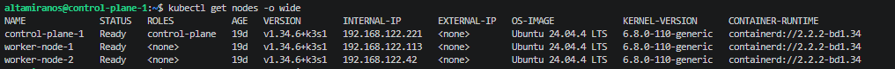

Shows that the K3s cluster consists of one control-plane node and two worker nodes, all in Ready state.

## 2. Workloads across all namespaces

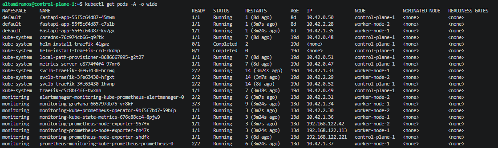

Shows workloads running across the cluster, including the default, kube-system and monitoring namespaces.

## 3. FastAPI pods and ServiceAccount

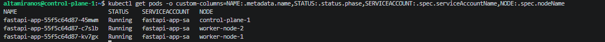

Shows the FastAPI pods running and using the dedicated ServiceAccount for the application workload.

## 4. FastAPI service through NodePort

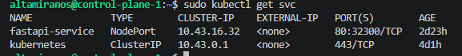

Shows the FastAPI Kubernetes Service and the NodePort used during verification.

## 5. FastAPI browser access through ingress

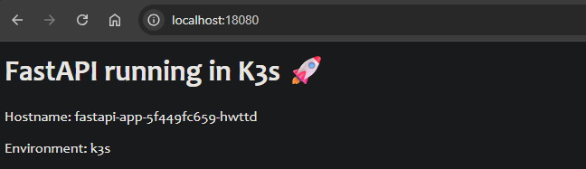

Shows the FastAPI application reachable from the browser after ingress and SSH tunneling were configured.

## 6. Traefik ingress resources

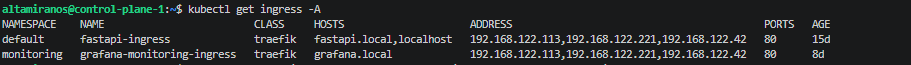

Shows the FastAPI and Grafana ingress resources exposed through Traefik.

## 7. Grafana exposed through ingress

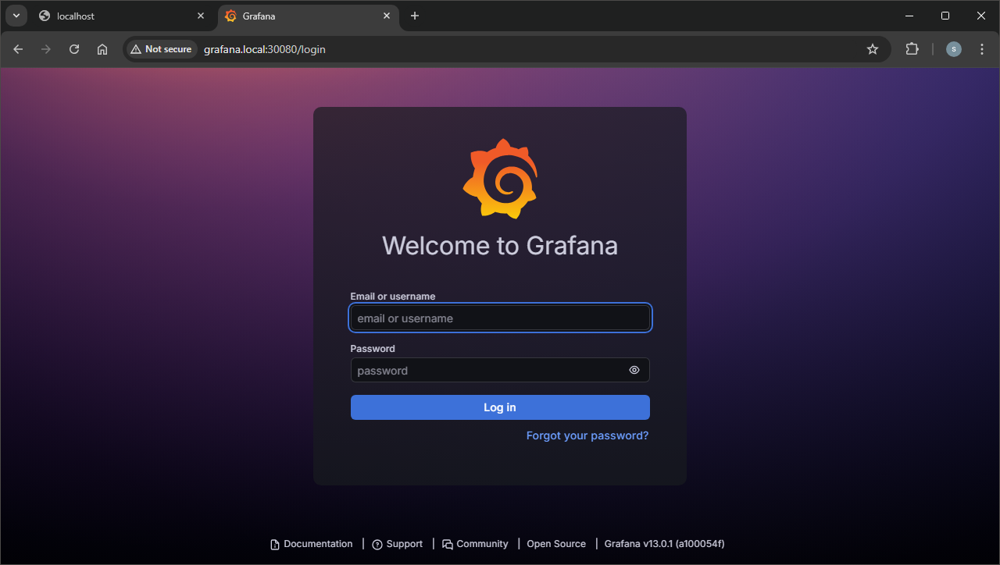

Shows Grafana reachable through the browser using the grafana.local hostname and SSH tunnel.

## 8. Prometheus data source in Grafana

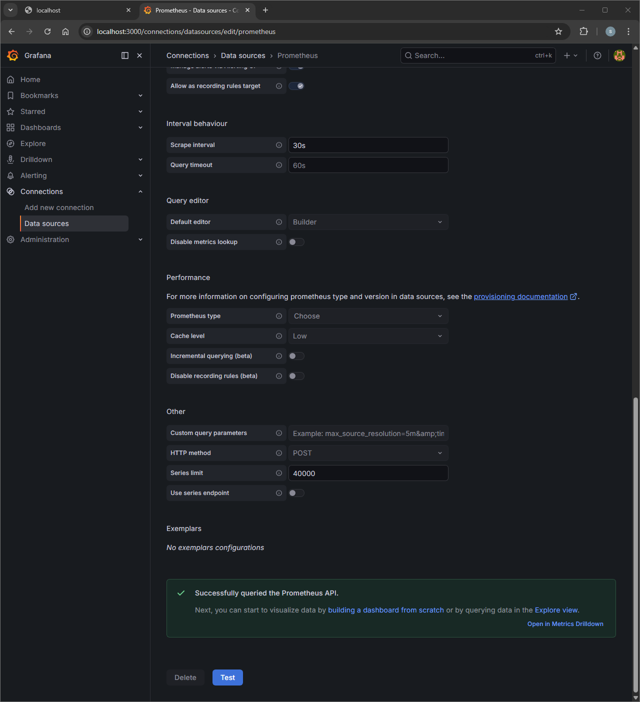

Shows that Grafana is configured with Prometheus as a provisioned data source.

## 9. Grafana dashboards list

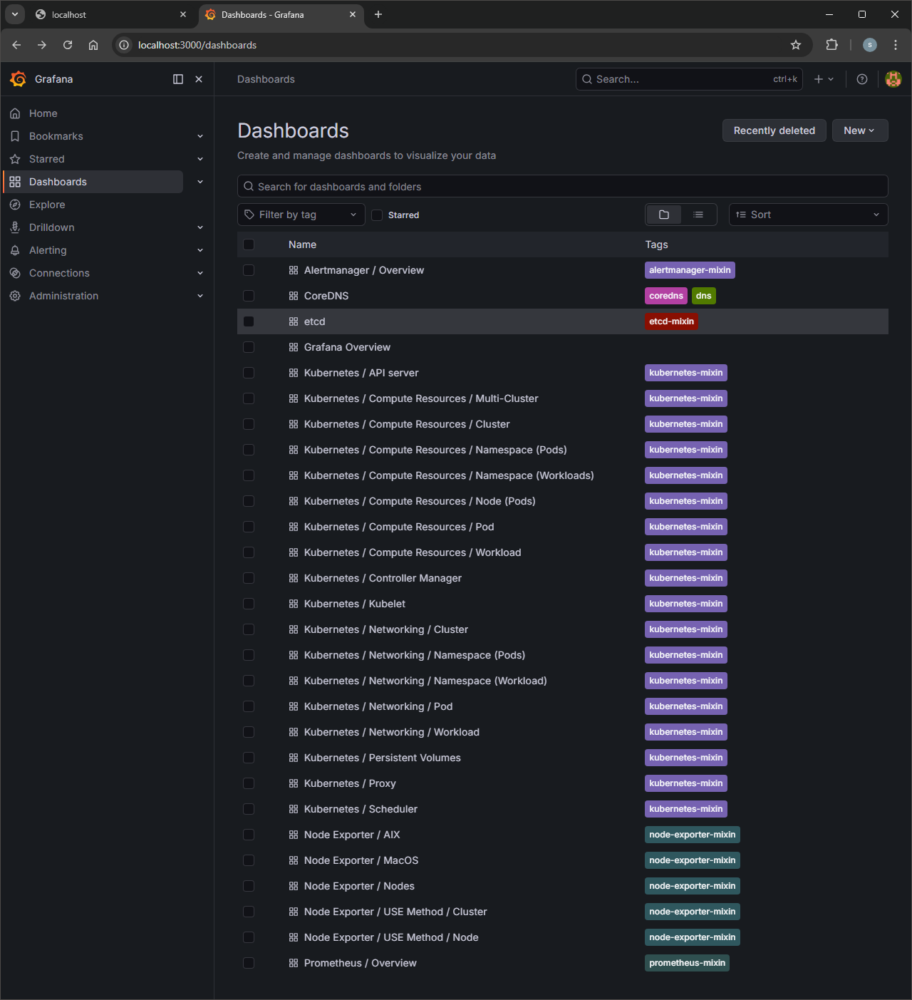

Shows the available Grafana dashboards installed through the monitoring stack.

## 10. Grafana node dashboard

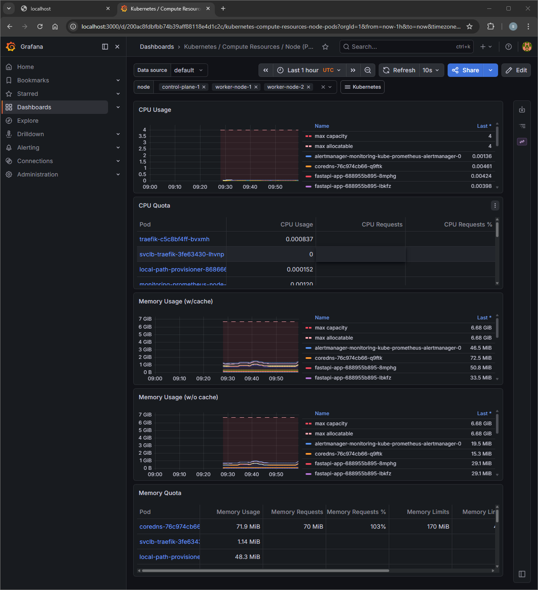

Shows node-level metrics such as CPU and memory usage.

## 11. Grafana FastAPI pod dashboard

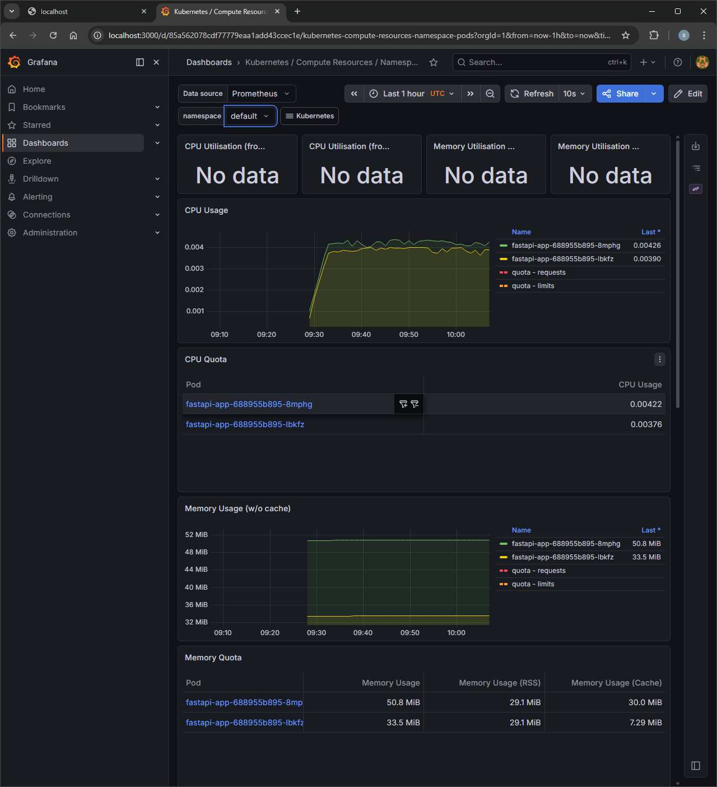

Shows metrics for the FastAPI pods running in the default namespace.

## 12. RBAC verification

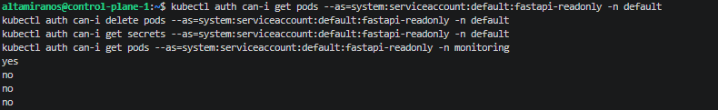

Shows that the read-only ServiceAccount is allowed to read pods, but denied write access, secret access and access to the monitoring namespace.
